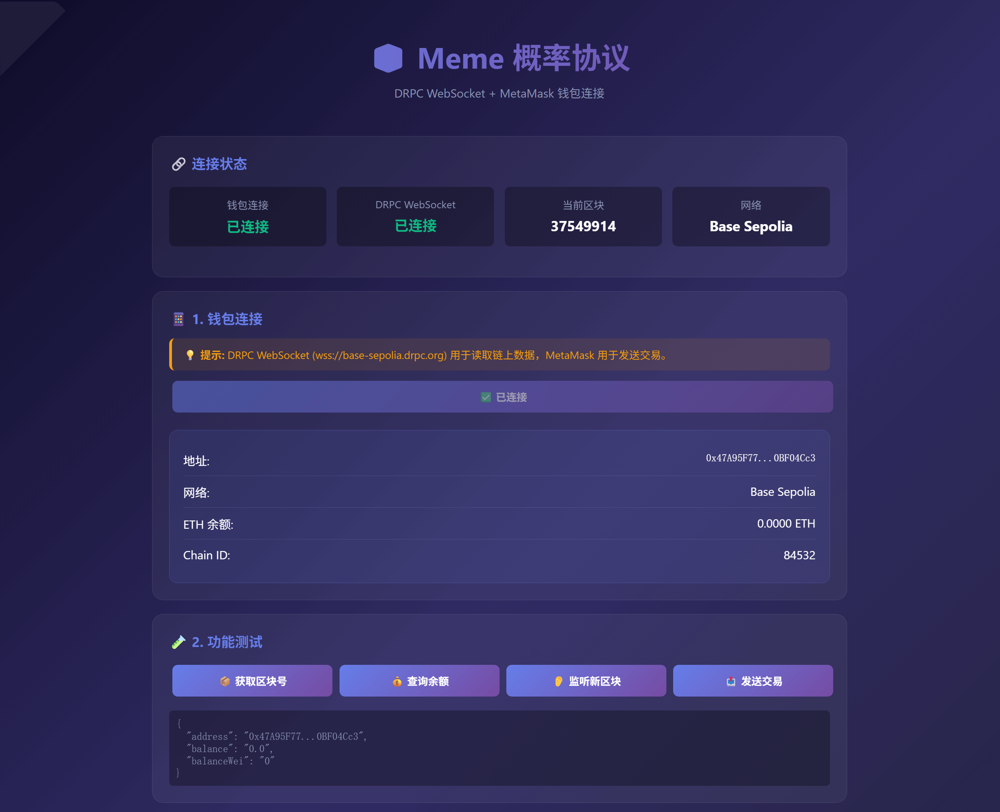

# ProbForge: Validating Meme Probabilities

**ProbForge** is a permissionless prediction market protocol designed to validate the probabilities of meme coin success. Built during the **RobinPump Hackathon**, our immediate goal is to empower the RobinPump community, but our vision is to serve **all** memecoin communities with a trustless, decentralized verification layer.

## 🌟 Key Features

### 🔓 Permissionless Market Creation
Unlike traditional prediction markets that require centralized approval, **ProbForge allows anyone** to create a prediction market for any meme coin. Whether it's "Will $DOGE hit $1?" or "Will a new RobinPump launch reach 100k MC?", the community decides what is worth predicting.

### ⚡ Automatic On-Chain Settlement
We eliminate the need for centralized oracles or subjective dispute resolution. Markets are **settled automatically and trustlessly** based on verifiable on-chain data (e.g., Token Market Cap, Liquidity, or DexScreener API data via oracles).
- **No human intervention required.**
- **Immediate payouts upon resolution.**



---

## 📹 Demo Video

https://github.com/lmmsoft/ProbForge/blob/main/demo_video.mp4

## 📸 Screenshots
*(Add screenshots of your UI here)*

## 🔗 Interaction with the Relevant Blockchain

ProbForge interacts with the **Base** blockchain to provide a fully decentralized experience. Here is the technical breakdown:

### 1. Market Creation
*   **Contract:** `MarketFactory.sol`
*   **Function:** `createMarket`
*   **Interaction:** Users call this function to deploy a new prediction market.
    *   **Input:** Users provide the `question`, `resolutionTime`, `initialYesPrice`, and settlement parameters (e.g., target token address, target market cap).
    *   **Bond:** Users must send a creation bond (ETH) to prevent spam.
    *   **Action:** The factory deploys a new `Market.sol` contract using `create2` for deterministic addresses and registers it.

### 2. Trading (AMM Stage)
*   **Contract:** `Market.sol`
*   **Mechanism:** The market uses a **Constant Product Bonding Curve** (`x * y = k`) to price YES/NO shares automatically.
*   **Buying:**
    *   **Function:** `buy(Side side, uint256 amountIn)`
    *   **Interaction:** Users approve USDC spending and call `buy`. The contract transfers USDC from the user, calculates the fee (0.3%), updates the AMM reserves (increasing the pool for the bought side), and credits the user with outcome shares.
*   **Selling:**
    *   **Function:** `sell(Side side, uint256 sharesIn)`
    *   **Interaction:** Users call `sell`. The contract calculates the USDC value of the shares based on current reserves, burns the shares, and transfers USDC back to the user.

### 3. Settlement
*   **Contract:** `Market.sol` & `Settlement.sol`
*   **Function:** `resolve(bool result)`
*   **Interaction:** Once the resolution time is reached or a specific on-chain condition is met (e.g., a meme coin hitting a market cap target), the `Settlement` contract (or Factory) triggers resolution.
*   **Claiming:**
    *   **Function:** `claimWinnings()`
    *   **Interaction:** After resolution, winners call this function. The contract verifies their holdings and the final result. If they hold the winning outcome, they can redeem their shares 1:1 for USDC.

### 4. Authentication (SIWE)
*   The frontend uses **Sign-In with Ethereum (SIWE)** to authenticate users.
*   Users sign a structured message with their wallet. This signature is verified off-chain (or potentially on-chain for advanced features) to create a secure session and audit log.

## 🎥 Video Explanation
*(Add a Loom video link here explaining how the project works, the repo structure, and a clear demo. This is vital for judges.)*

Example: [Loom Video Placeholder](https://www.loom.com/)

---

## 📂 Project Structure

```
ProbForge/
├── contracts/              # Solidity Smart Contracts
│   ├── MarketFactory.sol   # Deploys new markets
│   ├── Market.sol          # Core logic for each prediction market (AMM)
│   ├── Settlement.sol      # Logic for resolving markets
│   └── MockUSDC.sol        # Test token for development
├── hardhat/                # Hardhat Environment (Scripts & Tests)
├── script/                 # Foundry Deployment Scripts
├── demo-complete.html      # Full Frontend Demo (Single file with embedded Logic)
└── README.md               # This file
```

## 🚀 How to Run the Demo

1.  **Prerequisites:**
    *   A Web3 wallet (e.g., MetaMask, Rabby).
    *   Switch your wallet network to **Base**.
    *   Ensure you have some ETH (for gas) and USDC (for trading).

2.  **Open the Interface:**
    *   Simply open `demo-complete.html` in your browser. No build step is required for this vanilla JS implementation.

3.  **Interact:**
    *   **Connect:** Click "Connect Wallet".
    *   **Sign-In:** Click "SIWE Sign-In" to authenticate.
    *   **Create:** Use the "Create Market" form to deploy a new prediction market.
    *   **Trade:** Select a market, choose YES or NO, and enter an amount to trade.
    *   **View:** Watch your position updates and real-time logs.

## 🛠️ Technology Stack
*   **Blockchain:** Base
*   **Smart Contracts:** Solidity 0.8.20, Foundry, Hardhat
*   **Frontend:** HTML5, Vanilla JavaScript, Ethers.js v6
*   **Indexing:** WebSocket listeners for real-time updates
